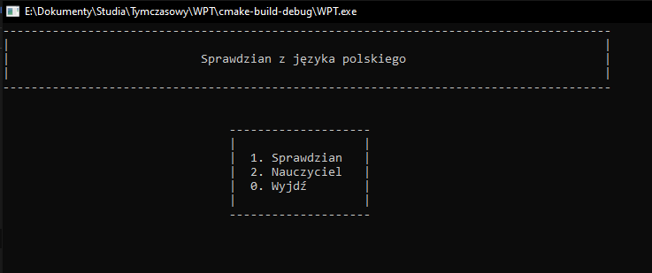
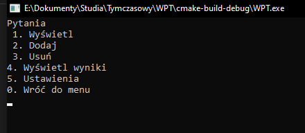

[Polski](Readme/Readme_PL.md)
# School Tester
Console application to performance tests from Polish language as school course. Program consists of four modules:
- general program,
- student,
- teacher,
- errors. 

First is loaded errors module. Check completeness of required files and, if missing, informs user. Next is showing main menu. 

Default username is `admin`, password: `systemu`. This "account" is deactivated after add first real user.

### Test (student module)
Student choose difficulty level, next answer on questions. Check is immediately – answer can be good (+1 point), bad (0 points) or have misspelling (user can fix mistake). On the test end, program calculate points, show mark [_of course in Polish system, see below_] and save information about user and mark. 
How to answer? 
When asked a question about a person, enter only the person's name (unless otherwise instructed). If you need to give the year, enter the number itself without the r. or rok [_year in Polish_]. Give titles without commas. In the selection, make spaces between letters.

### Teacher
After choosing of teacher module, user must enter username and password. Have 5 tries, after last failed, program was terminated. After successfully login teacher can choose:
1. Wyświetl (show) — show questions sorted by difficulty level
2. Dodaj (add) — can add question entered from keyboard or import from file 
   2.1. Wpisz (enter) 
   2.2. Import — get data from file in entered directory (without .txt extension). Program support questions seperated by semicolon, enter or tabulation.
   If question should be chosen type, answer should be followed by '|' sign (determines question's type). For example during add question "Choose romantic authors: A. Mickiewicz, B. Prus, C. Słowacki" as properly answer should be entered |A C.
3. Usuń (remove) — remove question by number
4. Wyświetl wyniki (show scores) — show scores sorted by difficulty level
5. Ustawienia (settings) — show settings menu 
   5.1. Liczba pytań (questions number) — default value is 4 
   5.2. Procenty ocen (grades percents) — ex. 5 from 90% 
   5.3. Dodaj użytkownika (add user) — add new user and set password for him 
   5.4. Wyświetl użytkowników (show users) — as name

### Default grade system
<table>
	<tr>
		<td>1! — 0%</td> <td>1 — 1%</td> <td>1+ — 25%</td>
	</tr>
	<tr>
		<td>2- — 30%</td> <td>2 — 35%</td> <td>2+ — 45% </td>
	</tr>
	<tr>
		<td>3- — 50%</td> <td>3 — 55%</td> <td>3+ — 70% </td>
	</tr>
	<tr>
		<td>4- — 75%</td> <td>4 — 80%</td> <td>4+ — 85% </td>
	</tr>
	<tr>
		<td>5- — 90%</td> <td>5 — 91%</td> <td>5+ — 100%</td>
	</tr>
	<tr>
		<td colspan="3">6 — 101% (learner has met all the requirements and has done something extra to the core curriculum)</td>
	</tr>
</table>

Main menu 

Teacher menu 
