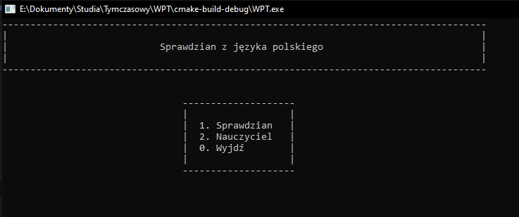
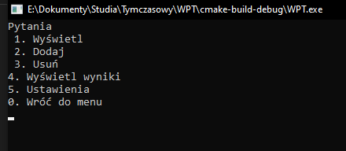

[English](../readme.md)
# Wspomaganie przeprowadzania testów
Konsolowa aplikacja służąca do przeprowadzania testów z języka polskiego. Program obecnie składa się z czterech modułów:
- ogólnego programu,
- ucznia,
- nauczyciela,
- błędów. 

Jako pierwszy w programie ładuje się moduł błędów. Sprawdza on kompletność wymaganych plików i, w razie ich braku, informuje użytkownika o tym. Następnie pojawia się menu główne. 

Domyślna nazwa użytkownika to `admin`, hasło: `systemu`. To „konto” dezaktywuje się po dodaniu pierwszego prawdziwego użytkownika.

### Sprawdzian (moduł ucznia) 
Uczeń wybiera poziom trudności, a następnie udziela odpowiedzi na pytania. Sprawdzenie następuje natychmiast — odpowiedź może być dobra (+1 punkt), zła (0 punktów) lub zawiera literówkę (program prosi o podanie jeszcze raz). Gdy sprawdzian zakończy się, następuje przeliczenie punktów, wyświetlenie oceny oraz zapisanie informacji kto i co dostał. 
Jak odpowiadać? 
Gdy zadane będzie pytanie o osobę, podaj tylko jej nazwisko (chyba że w poleceniu będzie inaczej). Jeśli trzeba będzie podać rok, wpisz samą liczbę bez r. czy rok. Tytuły podawaj bez cudzysłowów. W wybieraniu rób odstępy między literami.

### Nauczyciel
Po wybraniu modułu nauczyciela użytkownik zostanie poproszony o podanie nazwy oraz hasła. Ma 5 prób, gdy ostatnia się nie powiedzie, program zakończy działanie. Po pomyślnym zalogowaniu nauczyciel/ka ma do wyboru:
1. Wyświetl — wyświetla pytania według poziomu trudności
2. Dodaj — umożliwia dodanie pytań wpisanych z klawiatury lub ich import 
   2.1. Wpisz 
   2.2. Import — pobiera dane z pliku o podanej lokalizacji (podanej bez rozszerzenia .txt). Program obsługuje pytania oddzielone średnikiem, enterem lub tabulacją.
   Jeśli pytanie ma być typu wybieranego, odpowiedź proszę poprzedzić znakiem „|” (pomaga programowi ustalić typ pytania). Przykładowo przy dodawaniu pytania „Wybierz autorów romantycznych: A. Mickiewicz, B. Prus, C. Słowacki” jako prawidłową odpowiedź należy podać |A C.
3. Usuń — usuwa pytanie o podanym numerze
4. Wyświetl wyniki — wyświetla wyniki według poziomu trudności
5. Ustawienia — wywołuje menu ustawień 
5.1. Liczba pytań — domyślna wartość to 4 
5.2. Procenty ocen — np. 5 od 90% 
5.3. Dodaj użytkownika — dodaje nowego użytkownika oraz ustawia dla niego hasło 
5.4. Wyświetl użytkowników — jak nazwa

Menu główne 

Menu nauczyciela 
